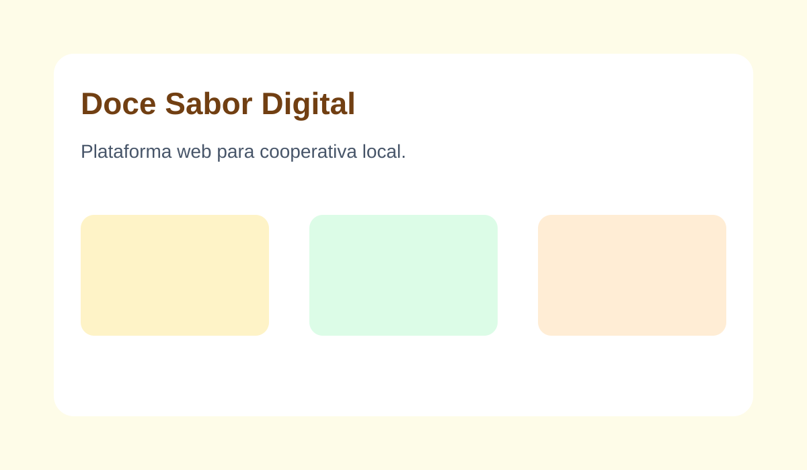
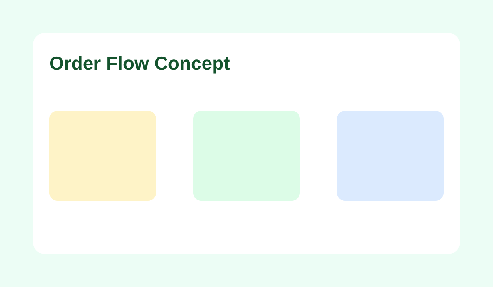

# Projeto de Extensão — Plataforma Web para a Cooperativa

Este repositório foi organizado com uma estrutura inicial para o projeto **Doce Sabor Digital**, separando backend, frontend e documentação.

## Screenshots





## Estrutura

```text
doce-sabor-digital/
├── backend/
│   ├── src/
│   ├── package.json
│   └── README.md
├── frontend/
│   ├── src/
│   ├── public/
│   ├── package.json
│   └── README.md
├── docs/
│   ├── relatorio-resumido.md
│   └── imagens/
├── screenshot-1.svg
├── screenshot-2.svg
├── .gitignore
├── README.md
└── LICENSE
```

## Objetivo

Construir uma plataforma web para apoiar a cooperativa em processos digitais como:

- divulgação de produtos/serviços;
- contato com clientes;
- organização de informações institucionais;
- evolução para funcionalidades administrativas.

## Próximos passos sugeridos

1. Implementar API no `backend/src`.
2. Criar interface do usuário no `frontend/src`.
3. Registrar decisões e evolução no `docs/relatorio-resumido.md`.
4. Padronizar scripts (`dev`, `build`, `test`) em backend e frontend.

## Como começar

### Backend

```bash
cd doce-sabor-digital/backend
npm install
npm run dev
```

### Frontend

```bash
cd doce-sabor-digital/frontend
npm install
npm run dev
```

> Observação: os arquivos atuais são um ponto de partida. Ajuste dependências e scripts conforme o framework escolhido.
